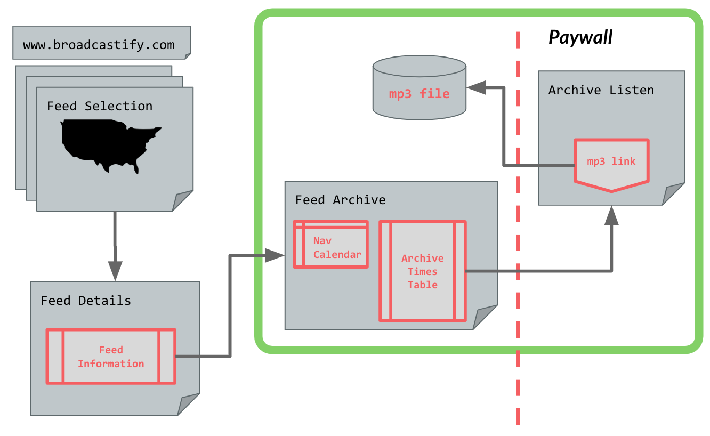

# Broadcastify ARchive Toolkit (BArT)<br>Documentation

**Version 0.5**<br>
```
   |\/\/\/|  +------------------------+
   |      |  | Eat my shortwave, man. |
   |      |  +------------------------+
   | (o)(o)    /
   C      _)  /
    | ,___|
    |   /
   /____\
  /      \
```
<sub><sup>Artwork source: https://www.asciiart.eu/cartoons/simpsons</sub></sup>
<br><br>
## Preface

The Broadcastify Archive Tool (BArT) automates downloading audio archives from [Broadcastify](www.broadcastify.com), "the world's largest source of Public Safety, Airline, Rail, and Marine live audio streams".

BArT was initially developed as part of a group project during the summer 2019 [General Assembly Data Science Immersive program](https://generalassemb.ly/education/data-science-immersive/), in response to a client's need to visualize where first responders were being dispatched during emergencies. We sought out a large repository of emergency radio dispatches to train our audio-to-text-to-geolocation algorithm. Although Broadcastify was the clear winner in terms of breadth and depth, the lack of an API for downloading archived audio meant that the process for acquiring the data was highly manual and time-consuming.

BArT solves that problem.

## Quick-start Guide

If you want quickly make use of BArT in your own Python project, this section is for you!

1. **Get a Broadcastify Premium account.** Access to the archives is behind a paywall. For $15, you can get 180 days of preimium access.
    - More information at https://m.broadcastify.com/premium/
    - Once you have your login info, give the [BArT demo](https://github.com/ljhopkins2/BArT/blob/master/bart_demo.ipynb) a try<br><br>

1. **Copy the library file.** It contains the BArT source code.
    - Put `bart.py` into the same directory as your `.ipynb` file<br><br>

1. **Copy and modify the config files.** The system needs two config files to run:
    - `config.ini`
        - Ensure it's in the same directory as the `.py` & `.ipynb` files
        - Edit the `MP3_OUT_PATH` value to point to where you want to store `mp3` files. Note that _the directory must exist before downloading archive files_, or you'll get an error
        - Edit the `AUTH_DATA_PATH` value to point to your `pwd.ini`
    - `pwd.ini`
        - Use the [`sample_pwd.ini`](https://github.com/ljhopkins2/BArT/blob/master/sample_pwd.ini) in this repo as a template
        - Add your Broadcastify premium username & password in the appropriate spots
        - Assuming you're using GitHub, save the file to a directory that's either not in the repo or is listed in your `.gitignore` file (this is important so that your login information doesn't become part of your commit history)<br><br>

1. **Install selenium**. Selenium is a browser emulator used to interact with Broadcastify's archive navigation tools.
    - Install with `pip install -U selenium`<br><br>
    
1. **Get a browser driver**. Selenium requires a driver to interface with your chosen browser. All testing for BArT is done with the Chrome browser driver (currently v77).
    - Install [Chrome's browser driver](https://sites.google.com/a/chromium.org/chromedriver/downloads), or the browser of your choice (see [the list on the selenium pyPI page](https://pypi.org/project/selenium/)
    - You must either 
      1. ensure the driver is in your computer's `PATH` (here's [a great resource for Mac users](https://www.architectryan.com/2012/10/02/add-to-the-path-on-mac-os-x-mountain-lion/#.Uydjga1dXDg) on that front) OR
      1. supply a relative path to the driver (including driver name) in `config.ini` > `[selenium_config]` > `WEBDRIVER_PATH`<br><br>

1. **Fulfill the dependencies**. Ensure you've installed and upgraded the following Python libraries:
    - `BeautifulSoup4`
    - `collections`
    - `configparser`
    - `datetime`
    - `IPython.display`
    - `os`
    - `re`
    - `requests`
    - `time`<br><br>

## <span style="color:red">**DOCUMENTATION UNDER DEVELOPMENT**</span>

**_This project is just getting under way. Some documentation is included in the docstrings of the `.py` file. Stay tuned for more complete user documentation._**

## Longer, but More Thorough, Guide

### Object Model

### Use Case Walk-throughs

## FAQ
* How are Broadcastify archive pages structured?<br>

